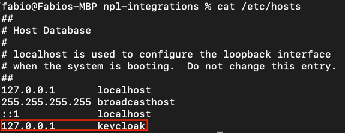

# npl-integrations

The npl-integrations repo contains a sample project that demonstrates how to integrate with [Noumena's Engine](https://documentation.noumenadigital.com/engine/applications/engine/) using
different programming languages and frameworks.
It includes a Python listener service, a Typescript React web app, and a Python Streamlit UI.

The underlying NPL code is an extension of the IOU, which can be found
in the [npl-starter](https://github.com/NoumenaDigital/npl-starter) repository.

## Building and running with Docker locally

The project can be built and run locally using Docker Compose.
To run the Noumena Engine, the corresponding Docker image is required, which is available under license. 
Please contact Noumena Digital for more information at [info@noumenadigital.com](mailto:info@noumenadigital.com)

The npl-integrations project can be locally built and all containers run locally using Docker Compose.

### Pre-requisites

#### OS X and linux systems
Make sure the `/etc/hosts` file includes the line `127.0.0.1 keycloak`



If the line is not present, add it by running `echo "127.0.0.1 keycloak" | sudo tee -a /etc/hosts` in the terminal.

#### Windows systems

Make sure the `c:\Windows\System32\Drivers\etc\hosts` file includes the line `127.0.0.1 keycloak` and add it if missing.

### Build & run

To build and run the project, follow the steps below:

1. Run `mvn clean install` to build and generate NPL-API and clients.
2. Run `docker compose up --build -d` to ensure the Python listener service, the Python Streamlit UI and the Typescript React frontend are built in addition to the Engine and its dependencies, then create and start the containers.

### Service endpoints

Once the project is running, services can be accessed with the following URLs:

| Service                   | URL                                |
|---------------------------|------------------------------------|
| Engine APIs               | http://localhost:12000/            |
| Swagger UI of Engine APIs | http://localhost:12000/swagger-ui/ |
| Keycloak admin console    | http://keycloak:11000              |
| Webapp                    | http://localhost:8090              |
| Inspector                 | http://localhost:8070              |

## Running NPL on Noumena Cloud & local services

Alternative to the local setup, NPL can be deployed on Noumena Cloud.
Noumena offers a cloud-based environment for running NPL code, which can be accessed at [portal.noumena.cloud](https://portal.noumena.cloud).

In this setup, to allow a setup without Docker Compose, the Python listener, Python Streamlit UI & Typescript React webapp are not run in Docker containers.

This setup includes running a Python listener, Python Streamlit UI & Typescript React webapp locally, and Noumena Engine on Noumena Cloud.

### NPL and keycloak

In this setup, NPL code runs on Noumena Cloud. Supporting services of the NPL Engine are deployed alongside the NPL Engine.
Supporting services include Keycloak for authentication and authorization, and databases.

#### Option 1: Using the NPL CLI & terraform

1. Install the NPL CLI by running `make download-cli` in the root directory.
2. Add the following variables to your shell to configure the NPL CLI and restart your terminal

    ```
    export NC_BASE_URL=https://portal.noumena.cloud
    export NC_EMAIL=your.email@your.domain
    export NC_ENV=PROD
    ```

3. Run `make create-app` to create the application with the name defined in the Makefile.
4. Run `make iam` to provision keycloak on the created application using terraform.
5. Run `make clear-deploy` to clear pre-existing packages in the app and upload the current NPL and migration sources.

#### Option 2: Using the NPL-Dev plugin for IntelliJ

1. Edit run configurations by clicking on the three vertical dots icon at the top right of IntelliJ
2. Add a new configuration by clicking on the `+` icon and selecting `Deploy to Noumena Cloud`
3. Input the following values:
    - `Server base URL`: https://portal.noumena.cloud
    - `Application ID`: The application ID found on the settings page of your app in the Noumena Cloud UI
    - `Username`: Your email address for Noumena Cloud
    - `Password`: Your password for Noumena Cloud
    - `Source path`: The absolute path within the project and ending with `/npl/src/main`. This is where the `npl`, `kotlin-script` and `yaml` folders are located.

4. Click `Run` to save and run the configuration

In addition, Keycloak can be configured from the `Services` tab in the Noumena Cloud UI.

#### Option 3: Using the Noumena Cloud UI

1. Create a zip file by running the `zip -r sources.zip npl/src/main/` command in the root directory.
2. In the Noumena Cloud UI, click on `Upload packages` and upload the zip file.

### Python-Listener

The `./python-listener` folder contains a Python service interacting with the configured Engine.
In this setup, the Python listener service runs locally and connects to the Engine on Noumena Cloud.

#### Setup

1. In the root directory, set up & activate your Python venv
2. run `mvn install` to generate the Python client from the NPL code
3. run `cd python-listener && pip install -r requirements.txt`

Note: it is needed to install requirements every time NPL code is changed.
This is because the generated code is installed as a package for easier use.

#### Running

From the root directory, run `cd python-listener && python main.py`

### Webapp

The `./webapp` folder contains a Typescript frontend service for interacting with the configured Engine.
In this setup, the webapp runs locally and connects to the Engine on Noumena Cloud.

#### Setup

1. run `mvn install` to generate the webapp client from the NPL code
2. run `cd webapp && npm install`

#### Running

run `cd webapp && npm run dev`

### Streamlit UI

The `./streamlit-ui` folder contains a frontend implemented in Python with the Streamlit library.
In this setup, the Streamlit UI runs locally and connects to the Engine on Noumena Cloud.

#### Setup

1. set up & activate your Python venv
2. run `mvn install` to generate the Python client from the NPL code
3. run `cd streamlit-ui && pip install -r requirements.txt`

Note: it is needed to install requirements every time NPL code is changed.
This is because the generated code is installed as a package for easier use.

#### Running

run `cd streamlit-ui && streamlit run main.py`

### Service endpoints

Once the project is running, services run behind the following URLs:

| Service                   | URL                                                                  |
|---------------------------|----------------------------------------------------------------------|
| Engine APIs               | `https://engine-$NC_ORG_NAME-$NC_APP_NAME.noumena.cloud`             |
| Swagger UI of Engine APIs | `https://engine-$NC_ORG_NAME-$NC_APP_NAME.noumena.cloud/swagger-ui/` |
| Keycloak admin console    | `https://keycloak-$NC_ORG_NAME-$NC_APP_NAME.noumena.cloud`           |
| Webapp                    | http://localhost:5173                                                |
| Streamlit UI              | http://localhost:8501                                                |

## Next steps

You now know everything you need to know about NPL deployment in order to start developing your own applications on top of the Engine in your preferred language.

For more information about the Engine, please refer to
the [NPL documentation](https://documentation.noumenadigital.com/). 
