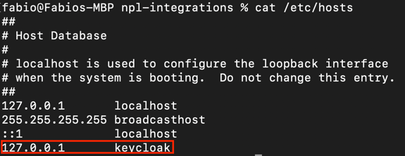

# npl-integrations

## Table of contents

- [Introduction](#introduction)
- [Renaming the repository](#renaming-the-repository)
- [Building and running with Docker locally](#building-and-running-with-docker-locally)
  - [Pre-requisites](#pre-requisites)
  - [Build & run](#build--run)
  - [Service endpoints](#service-endpoints)
- [Running NPL on Noumena Cloud & local services](#running-npl-on-noumena-cloud--local-services)
  - [NPL and keycloak](#npl-and-keycloak)
  - [Python-Listener](#python-listener)
  - [Webapp](#webapp)
  - [Streamlit UI](#streamlit-ui)
  - [Service endpoints](#service-endpoints-1)
- [Running pipelines against NOUMENA Cloud](#running-pipelines-against-noumena-cloud)
- [NPL Development](#npl-development)
- [Next steps](#next-steps)

## Introduction

The npl-integrations repo contains a sample project that demonstrates how to integrate with [Noumena's Engine](https://documentation.noumenadigital.com/engine/applications/engine/) using
different programming languages and frameworks.
It includes a Python listener service, a Typescript React web app, and a Python Streamlit UI.

The underlying NPL code is an extension of the IOU, which can be found
in the [npl-starter](https://github.com/NoumenaDigital/npl-starter) repository.

Details about each component can be found in the corresponding README files in the respective directories.
- [NPL](npl/README.md)

## Renaming the repository

To rename the repository, follow the steps below. Make sure to replace `<new-project-name>` with the desired name.
```shell
export PROJECT_NAME=<new-project-name>
perl -p -i -e's/npl-integrations/$(PROJECT_NAME)/g' `find . -type f`
perl -p -i -e"s/nplintegrations/$(shell echo $(PROJECT_NAME) | tr '[:upper:]' '[:lower:]' | tr -d '-')/g" `find . -type f`
cd .. && mv npl-integrations $(PROJECT_NAME);
```

## Building and running with Docker locally

The project can be built and run locally using Docker Compose.
To run the Noumena Engine, the corresponding Docker image is required, which is available under license. 
Please contact Noumena Digital for more information at [info@noumenadigital.com](mailto:info@noumenadigital.com)

The npl-integrations project can be locally built and all containers run locally using Docker Compose.

### Pre-requisites

#### OS X and linux systems
Make sure the `/etc/hosts` file includes the line `127.0.0.1 keycloak`



If the line is not present, add it by running `echo "127.0.0.1 keycloak" | sudo tee -a /etc/hosts` in the terminal.

#### Windows systems

Make sure the `c:\Windows\System32\Drivers\etc\hosts` file includes the line `127.0.0.1 keycloak` and add it if missing.

### Build & run

To build and run the project, follow the steps below:

1. Run `make install` to build and generate NPL-API and clients.
It also builds Python listener service, the Python Streamlit UI and the Typescript React frontend in addition to the Engine and its dependencies.
2. Run `make up` to create and start the containers.

To stop the containers, run `make down`.

### Service endpoints

Once the project is running, services can be accessed with the following URLs:

| Service                   | URL                                |
|---------------------------|------------------------------------|
| Engine APIs               | http://localhost:12000/            |
| Swagger UI of Engine APIs | http://localhost:12000/ |
| Keycloak admin console    | http://localhost:11000              |
| Webapp                    | http://localhost:8090              |
| Inspector                 | http://localhost:8070              |

## Running NPL on Noumena Cloud & local services

Alternative to the local setup, NPL can be deployed on Noumena Cloud.
Noumena offers a cloud-based environment for running NPL code, which can be accessed at [portal.noumena.cloud](https://portal.noumena.cloud).

In this setup, to allow a setup without Docker, the Python listener, Python Streamlit UI & Typescript React webapp are run as services outside of docker containers.

This setup includes running a Python listener, Python Streamlit UI & Typescript React webapp locally, and Noumena Engine on Noumena Cloud.

### NPL and keycloak

In this setup, NPL code runs on Noumena Cloud. Supporting services of the NPL Engine are deployed alongside the NPL Engine.
Supporting services include Keycloak for authentication and authorization, and databases.

#### Option 1: Using the NPL CLI

1. Install the NPL CLI by running `make cli` in the root directory.
2. [Create an application on NOUMENA Cloud](https://documentation.noumenadigital.com/cloud/portal/create-app/)
3. [Create users on NOUMENA Cloud](https://documentation.noumenadigital.com/cloud/portal/create-users/)
4. Log in the NPL CLI to NOUMENA Cloud by running `npl cloud login`
5. Run `make clear-deploy` to clear pre-existing packages in the app and upload the current NPL and migration sources.

#### Option 2: Using the Noumena Cloud UI

1. Create a zip file by running the `make zip` command in the root directory. A zip file will be created in the `target` directory.
2. In the Noumena Cloud UI, click on `Upload packages` and upload the zip file.

### Python-Listener

The `./python-listener` folder contains a Python service interacting with the configured Engine.
In this setup, the Python listener service runs locally and connects to the Engine on Noumena Cloud.

#### Setup

To set up your Python venv, to generate the Python client from the NPL code and install python requirements, run
```shell
make python-listener-client
```

Note: the generated client need to be installed every time NPL code is changed as the generated code is installed as a package.

#### Running

From the root directory, run 
```shell
make python-listener-run
```

To stop the service, press `Ctrl+C`
To keep the service running and continue this walkthrough, open a new terminal window.

### Webapp

The `./webapp` folder contains a Typescript frontend service for interacting with the configured Engine.
In this setup, the webapp runs locally and connects to the Engine on Noumena Cloud.

#### Setup

From the root directory, run 
```shell
make webapp-client
```
to generate the webapp client from the NPL code and install webapp dependencies

#### Running

From the root directory, run
```shell
make webapp-run
```

To stop the service, press `Ctrl+C`
To keep the service running and continue this walkthrough, open a new terminal window.

### Streamlit UI

The `./streamlit-ui` folder contains a frontend implemented in Python with the Streamlit library.
In this setup, the Streamlit UI runs locally and connects to the Engine on Noumena Cloud.

#### Setup

To generate the Python client from the NPL code and install python requirements, run 
```shell
make streamlit-ui-client
```

Note: the generated client need to be installed every time NPL code is changed as the generated code is installed as a package.

#### Running

From the root directory, run
```shell
make streamlit-ui-run
```

To stop the service, press `Ctrl+C`
To keep the service running and continue this walkthrough, open a new terminal window.

### Service endpoints

Once the project is running, services run behind the following URLs:

| Service                   | URL                                                                       |
|---------------------------|---------------------------------------------------------------------------|
| Engine APIs               | `https://engine-$VITE_NC_TENANT_SLUG-$NC_APP_NAME.noumena.cloud`             |
| Swagger UI of Engine APIs | `https://engine-$VITE_NC_TENANT_SLUG-$NC_APP_NAME.noumena.cloud/` |
| Keycloak admin console    | `https://keycloak-$VITE_NC_TENANT_SLUG-$NC_APP_NAME.noumena.cloud`           |
| Webapp                    | http://localhost:5173                                                     |
| Streamlit UI              | http://localhost:8501                                                     |

## Running pipelines against NOUMENA Cloud

For deployment or testing, the NPL CLI can be used in pipelines. An authorisation mode with services accounts
is available for this use case.

1. In the tenant page on NOUMENA Cloud, create a service account.
2. In your github repo running the pipeline, set the `NPL_SERVICE_ACCOUNT_CLIENT_SECRET` with the provided client secret

## NPL Development

After implementing the NPL code, tests can be run:
```shell
make npl-test
```
Or run using the NPL-Dev plugin in IntelliJ.

## Next steps

You now know everything you need to know about NPL deployment in order to start developing your own applications on top of the Engine in your preferred language.

For more information about the Engine, please refer to
the [NPL documentation](https://documentation.noumenadigital.com/). 
